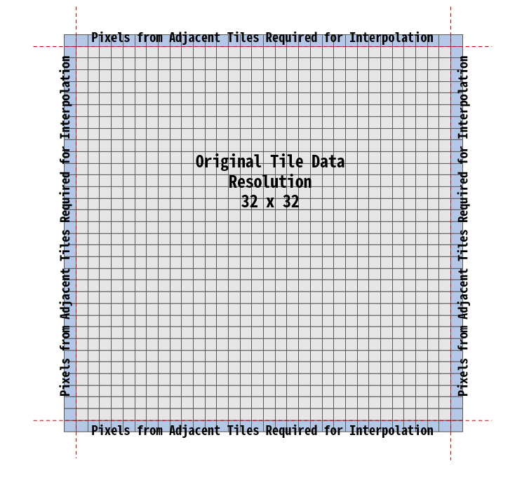

### data source

This is 2m surface temperature data (tmp2m) provided by ERDDAP.
The data is based on the GFS model.
It covers the period from December 1, 2022, to December 6, 2024, with the last week being forecast data.

https://pae-paha.pacioos.hawaii.edu/erddap/griddap/ncep_global.html

### tile : Pmtiles

The data is stored in the Pmtiles format, where the filenames represent Unix timestamps.

Each file contains global data for levels 0 to 5 based on Google Maps XYZ tile standards. Each tile is 32x32 pixels.

### Tile Overlapping for Interpolation

Each tile was expanded to 34x34 pixels by appending one row of adjacent tile pixels along the edges, enabling linear interpolation along the boundaries. For tiles at the edges with no adjacent tiles, the size becomes 33 pixels.

When mapping the tiles, the rendering process must account for the size of 1 pixel in the coordinate system after transformation and clip half of the overlapping area accordingly.



### encoding & decoding

Every PNG tile contains temperature values for both the reference time and three hours later.
The RG and BA channels are used to separate the data: the RG channels store the reference time, while the BA channels encode the temperature three hours later.

You can refer to the following code for the decoding method.

```javascript
// Gradient scale configuration
const colorScale = scaleSequential()
  .domain([-50, 60]) // Grayscale range 0 ~ 255
  .interpolator(interpolateTurbo);

const { data, width, height } = imageData;

const newImageData = new Uint8ClampedArray(data.length);
const timeT = (unixtime - unixTime / (3600 * 3)) / (3600 * 3);

for (let i = 0; i < data.length; i += 4) {
  // Decode 12-bit data
  const temperatureNow = data[i] + (data[i + 1] - 128) / 125 - 100; // Upper 12 bits
  const temperatureNext = data[i + 2] + (data[i + 3] - 128) / 125 - 100; // Lower 12 bits

  // Interpolated temperature based on current time ratio (timeT)
  const temperature =
    temperatureNow + (temperatureNext - temperatureNow) * timeT;

  // Determine color based on the current temperature
  const color = d3.rgb(colorScale(temperature));
  if (temperature > 40) {
    color.r = 250;
    color.g = 25;
    color.b = 5;
  } else if (temperature < -40) {
    color.r = 5;
    color.g = 10;
    color.b = 30;
  }

  // Save the resulting data in the newImageData array
  newImageData[i] = color.r; // Red
  newImageData[i + 1] = color.g; // Green
  newImageData[i + 2] = color.b; // Blue
  newImageData[i + 3] = 255; // Alpha value is always opaque (255)
}
```

### tip

Since the PNG files include an alpha channel, reading them with the default web browser decoder can cause alterations to the original values.
By specifying the fast-png library as the decoder in loaders.gl, you can read the files without any distortion to the original values.

```javascript

import { PMTilesSource, PMTilesTileSource } from "@loaders.gl/pmtiles";
import { ImageType } from "@loaders.gl/loader-utils";
import { ImageLoader } from "@loaders.gl/images";
import { decode } from "fast-png";

function getPmtilesIndex(timestamp: number) {

const url = `./pmtiles/${timestamp}.pmtiles`;

const loader = ImageLoader;
//@ts-ignore
loader.parse = async (arrayBuffer: ArrayBuffer, options: any) => {
    try {
    const image = await decode(arrayBuffer);
    return new ImageData(
        new Uint8ClampedArray(image.data),
        image.width,
        image.height
    );
    } catch (error) {
    console.error("Error decoding image:", error);
    throw error;
    }
};

const source = PMTilesSource.createDataSource(url, {
    loadOptions: {
    loaders: [loader], /
    image: {
        type: "data",
        decode: false,
    },

    },
});
return source;
}
```
